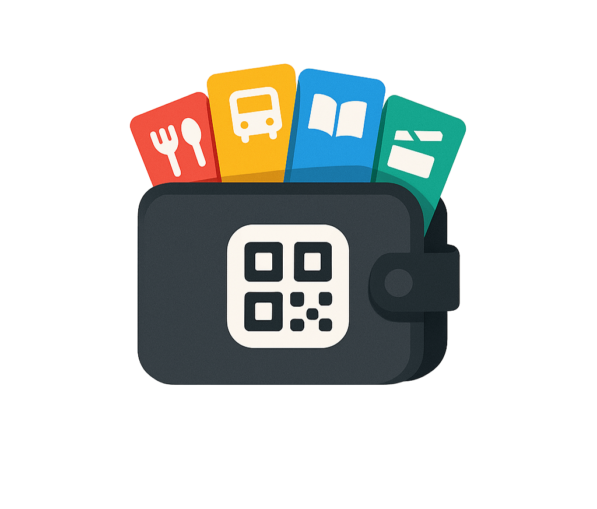

# UGO - Sistema de Tokens Digitales Universitarios

<div align="center">
  
  
  <h3>Prototipo conceptual de tokens digitales para universidades</h3>
  
  <p>
    <strong>Desarrollado con Next.js 15 y React 19</strong>
  </p>

  <p>
    
    
    
    
    
  </p>
</div>

## Propósito del Prototipo

### Objetivos de Demostración

Este prototipo ha sido desarrollado para:

1. **Visualizar el Concepto**: Mostrar cómo funcionaría un sistema de tokens digitales en un entorno universitario real
2. **Demostrar UX/UI**: Presentar interfaces intuitivas tanto para estudiantes como para administradores
3. **Validar Flujos de Usuario**: Probar la navegación y experiencia de usuario antes del desarrollo real
4. **Presentar a Stakeholders**: Facilitar la comprensión del proyecto a inversores, universidades y socios potenciales
5. **Base Técnica**: Servir como especificación técnica y visual para el equipo de desarrollo

### Casos de Uso Demostrados

- **Gestión de Tokens**: Creación, distribución y uso de diferentes tipos de tokens
- **Transferencias**: Envío de tokens entre usuarios (simulado)
- **Validación**: Scanner QR para verificación de tokens (interfaz únicamente)
- **Administración**: Panel completo de gestión institucional
- **Analytics**: Visualización de métricas y estadísticas de uso

---

## ⚠️ Aviso Importante

**Este es un prototipo conceptual con fines demostrativos únicamente.** UGO no es una aplicación funcional de producción, sino una representación visual e interactiva diseñada para:

- **Demostrar el concepto** de un sistema de tokens digitales universitarios
- **Visualizar la experiencia de usuario** tanto para estudiantes como administradores  
- **Presentar la propuesta de valor** a stakeholders e instituciones educativas
- **Servir como base técnica** para el desarrollo de la aplicación real

**Limitaciones del prototipo:**
- Utiliza datos simulados (mock data)
- No hay backend real ni base de datos
- Las transacciones no son reales
- No incluye integración blockchain
- Funciona completamente en el frontend

---

## Descripción General

UGO es un prototipo conceptual de un sistema de tokens digitales diseñado específicamente para entornos universitarios. Esta demostración interactiva ilustra cómo funcionaría una plataforma para la gestión, distribución y uso de tokens digitales para servicios como comida, transporte, biblioteca y control de acceso. El prototipo incluye dos interfaces principales: una aplicación móvil para estudiantes y un panel administrativo para gestión institucional.

### Funcionalidades Conceptuales Demostradas

**Aplicación Móvil (Vista Estudiante)**
- Billetera digital con gestión de cuatro tipos de tokens especializados
- Sistema simulado de transferencias peer-to-peer entre estudiantes
- Dashboard personal con visualización de balance y actividad ficticia
- Sistema de notificaciones de ejemplo
- Interfaz de códigos QR (sin funcionalidad real de scanner)

**Panel Administrativo (Vista Manager)**  
- Dashboard de control con métricas simuladas en tiempo real
- Interfaz de scanner QR con datos de ejemplo
- Herramientas conceptuales de creación y configuración de tokens
- Gestión simulada de usuarios y distribución masiva
- Sistema de analytics y reportes con datos ficticios

**Nota importante:** Todas las funcionalidades son simuladas con datos de prueba para demostrar el flujo de usuario y la experiencia visual. No se realizan transacciones reales ni se almacenan datos permanentemente.

---

## Arquitectura Técnica

### Stack Tecnológico

**Frontend Framework**
- Next.js 15.2.4 con App Router y Server Components
- React 19 con Concurrent Features
- TypeScript 5.0.2 para type safety completo

**Styling y UI**
- Tailwind CSS 4.1.9 con configuración personalizada
- Radix UI para componentes accesibles
- Lucide React para iconografía consistente
- Sistema de temas dinámicos (claro/oscuro)

**Estado y Lógica**
- React Context para gestión de estado global
- Custom Hooks para lógica reutilizable
- Manejo avanzado de estados de carga y errores

### Estructura del Proyecto

```
src/
├── components/
│   ├── layout/          # Layouts reutilizables
│   ├── modals/          # Componentes modales
│   └── ui/              # Sistema de diseño base
├── features/
│   ├── admin/           # Dashboard administrativo
│   └── mobile/          # Aplicación móvil
├── contexts/            # React Context providers
├── hooks/               # Custom hooks
├── lib/                 # Utilidades y configuración
├── services/            # Servicios y APIs
├── types/               # Definiciones TypeScript
└── constants/           # Constantes y datos mock
```

---

## Instalación del Prototipo

### Prerrequisitos

- Node.js 18.17.0 o superior
- npm, yarn, o pnpm
- Git

### Instalación y Ejecución

```bash
# Clonar el repositorio del prototipo
git clone https://github.com/Cbiux/Ugo-demo.git
cd ugo-tokens-prototype

# Instalar dependencias
npm install --legacy-peer-deps

# Ejecutar el prototipo en modo desarrollo
npm run dev

# Abrir http://localhost:3000 en el navegador
```

### Scripts Disponibles

```bash
npm run dev          # Servidor de desarrollo del prototipo
npm run build        # Build de producción del prototipo
npm run start        # Servidor de producción del prototipo
npm run lint         # Análisis de código
```

**Nota**: El prototipo funciona completamente en el frontend sin necesidad de configuración adicional.

---

## Funcionalidades Conceptuales

### Sistema de Tokens Simulado

El prototipo demuestra el manejo de cuatro tipos de tokens especializados:

- **Tokens de Comida**: Para servicios de alimentación en campus
- **Tokens de Transporte**: Para sistemas de transporte universitario  
- **Tokens de Biblioteca**: Para servicios bibliotecarios y recursos académicos
- **Tokens de Acceso**: Para control de acceso a laboratorios e instalaciones

Cada tipo de token incluye propiedades configurables como transferibilidad, fechas de vencimiento y límites de uso (todas simuladas).

### Experiencia de Usuario Demostrada

- Interfaz responsive optimizada para móvil y desktop
- Animaciones fluidas y feedback visual inmediato
- Sistema de temas con soporte para modo oscuro
- Diseño accesible siguiendo principios de usabilidad

### Simulaciones Incluidas

- **Transacciones**: Flujos completos de envío y recepción de tokens
- **Scanner QR**: Interfaz de escaneo con validación visual
- **Notificaciones**: Sistema de alertas y recordatorios
- **Analytics**: Dashboards con métricas y estadísticas
- **Gestión de Usuarios**: Herramientas administrativas completas

---

## Configuración Personalizada

### Sistema de Colores

El proyecto utiliza un sistema de colores corporativo personalizable:

- **Primario**: #2C3E50 (Charcoal profesional)
- **Comida**: #FF5757 (Rojo energético)
- **Transporte**: #FFA726 (Naranja dinámico)
- **Biblioteca**: #42A5F5 (Azul académico)
- **Acceso**: #66BB6A (Verde seguridad)

### Personalización Institucional

El sistema puede adaptarse fácilmente a diferentes instituciones mediante:

- Configuración de colores corporativos
- Personalización de tipos de tokens
- Adaptación de logos y branding
- Configuración de reglas de negocio específicas


### Diferencias entre Prototipo y Aplicación Real

| Aspecto | Prototipo Actual | Aplicación Real |
|---------|------------------|-----------------|
| Datos | Mock data estático | Base de datos real |
| Transacciones | Simuladas | Blockchain real |
| Scanner QR | Solo interfaz | Funcionalidad completa |
| Autenticación | No implementada | Sistema robusto |
| Notificaciones | Simuladas | Push notifications |
| Persistencia | No hay | Base de datos |

---

## Contribución

### Guías de Contribución

Las contribuciones son bienvenidas. Por favor, sigue estos pasos:

1. Fork el proyecto
2. Crea una rama para tu feature (`git checkout -b feature/nueva-funcionalidad`)
3. Commit tus cambios (`git commit -m 'Añadir nueva funcionalidad'`)
4. Push a la rama (`git push origin feature/nueva-funcionalidad`)
5. Abre un Pull Request

### Estándares de Código

- Utiliza TypeScript para todas las nuevas funcionalidades
- Sigue las convenciones de ESLint y Prettier configuradas
- Escribe tests para componentes críticos
- Documenta funcionalidades complejas

### Estructura de Commits

```
feat: nueva funcionalidad
fix: corrección de bug  
docs: actualización documentación
style: cambios de formato
refactor: refactorización código
test: adición de tests
chore: tareas mantenimiento
```

---

## Licencia

Este prototipo está bajo la licencia **MIT License**.

---

## Disclaimer

**Este es un prototipo conceptual únicamente.** No debe utilizarse en entornos de producción ni para transacciones reales. UGO es una demostración de concepto diseñada para ilustrar la viabilidad y experiencia de usuario de un sistema de tokens digitales universitarios.

**Derechos de Autor**: Todos los assets, diseños y conceptos mostrados en este prototipo son propiedad intelectual de los desarrolladores y están protegidos bajo las leyes de derechos de autor aplicables.
